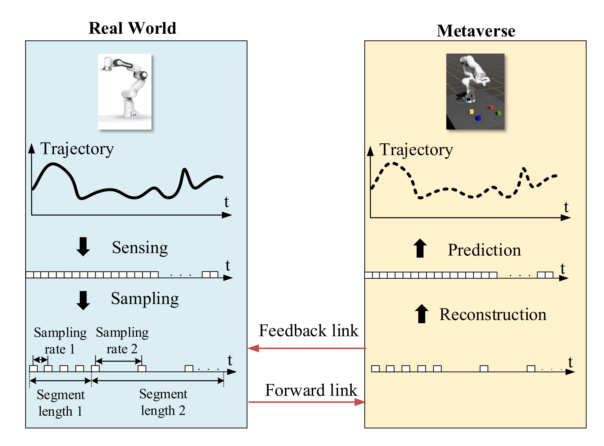

# Sampling, Communication, and Prediction Co-Design for Synchronizing the Real-World Device and Digital Model in Metaverse

Our design KC-TD3 is based on Twin Delayed Deep Deterministic Policy Gradients ([TD3](https://arxiv.org/abs/1802.09477)) ([code](https://github.com/sfujim/TD3)). 

Method is tested in [OpenAI gym](https://github.com/openai/gym). Networks are trained using [PyTorch 1.12](https://github.com/pytorch/pytorch) and Python 3.8. 

**We will release the code soon.**

### Results
Code is no longer exactly representative of the code used in the paper.
